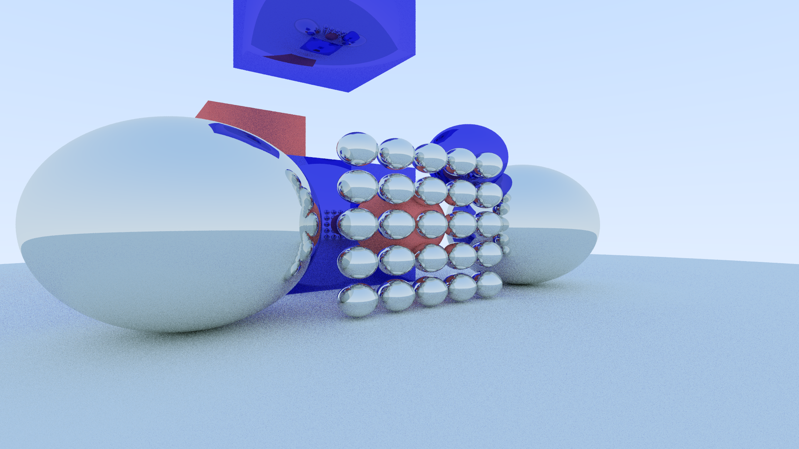

# Raytracer

Multi-threaded raytracer that uses kd-trees to speed up rendering.

# Example output

# Build requirements

[stb](https://github.com/nothings/stb) or more specifically stb_image_write.h for saving rendering results.

